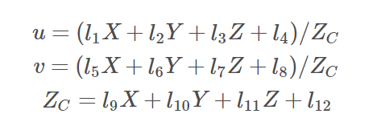
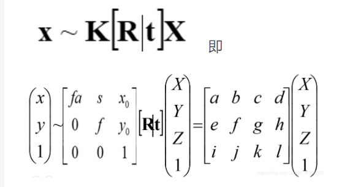
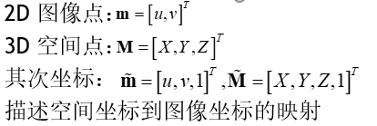
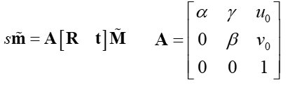
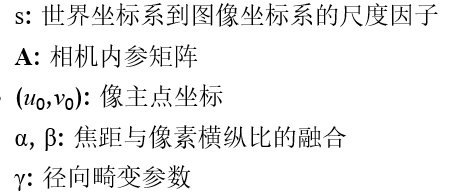
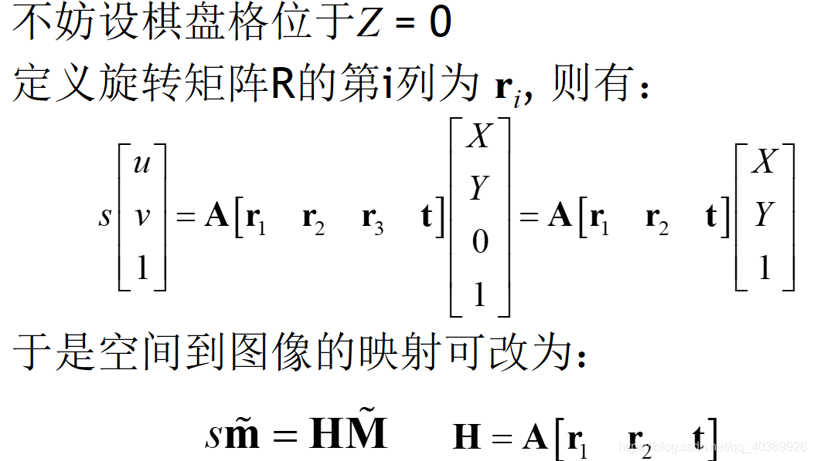
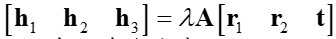
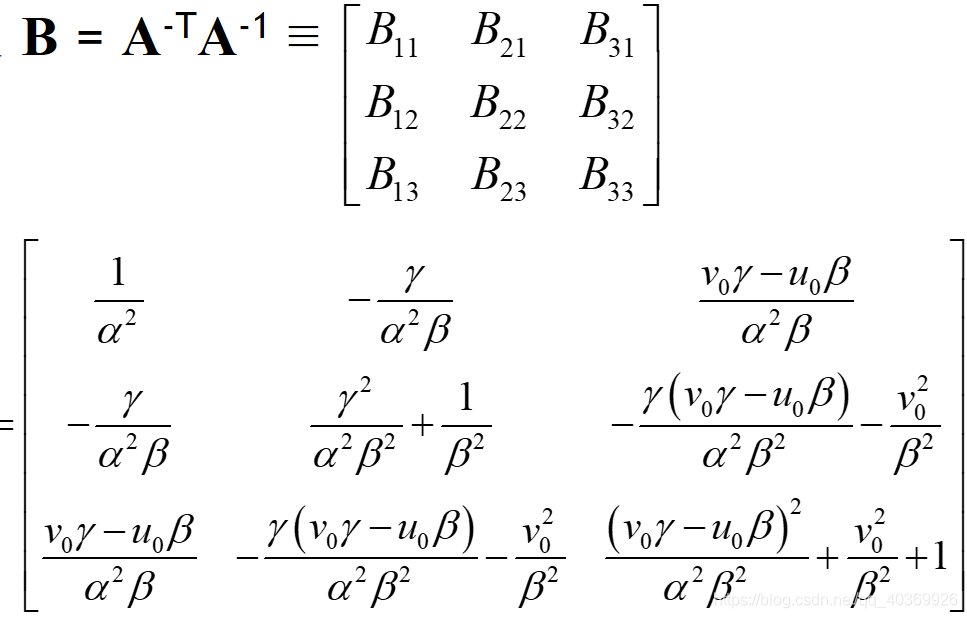

3.24 week4 学习

标定

为了精确的获得测量数据和真实世界物体的坐标位置关系，对测量仪器必须进行标定工作。标定分为内参标定和外参标定，内参标定是对测量仪器内部的标定，有对相机内参的标定，对lidar的标定，对imu的标定等；外参标定是对测量仪器之间相对位置的标定，以获得不同仪器采集数据之间的位置对应关系。

内参标定中，lidar、imu、量测相机的标定在出厂时，通常由厂家标定完成。我们仅对相机内参标定进行学习。

外参标定分为以下类别

|              |         相机          | 多线激光雷达 | 单线激光雷达 | GPS/IMU  |
| :----------: | :-------------------: | :----------: | :----------: | :------: |
|     相机     |       立体标定        |              |              |          |
| 多线激光雷达 | 相机和lidar的联合标定 |              |              | 手眼标定 |
| 单线激光雷达 |                       |              |              |          |
|   GPS/IMU    |                       |              |              |          |

# 内参标定：相机标定

相机拍摄中：物点到像点的坐标转换方程

$$
x=K*[R|t]*X\\
K:内参矩阵\\
[R|t]:外参矩阵
$$

**一、相机内参标定**

**1、DLT标定**

12个参数

（1）几何解法

求导求解，几何最优

传统实验方法：检测场标定

（2）数学解法

参考opencv库，为数学最优解法  

**2、张正友标定，棋盘格标定方法**

论文：https://ieeexplore.ieee.org/document/888718

CSDN：https://blog.csdn.net/qq_40369926/article/details/89251296

**模型假设：**

相机标定公式：

模型：

​														

**整体流程：**

（1）打印棋盘格，多角度拍照，获取相机数据

（2）理想无畸变情况下，求解相机的内参，和外参，极大似然估计

（3）求出径向畸变参数，L-M求解

（4）内外参数，和畸变，共同极大似然估计求解

（5）得到相机内外参数，畸变系数

**模型求解：**

（1）内外参数求解

H阵，为单应性矩阵3*3。9-1=8个参数

利用，中r1，r2正交，模均为1的性质，求解h1，h2.

剩余A阵中5个参数，通过3个单应性矩阵求解

（2）畸变系数求解

LM求解

（3）精度优化

MLE求解

附：

标定方式：

1、棋盘格标定

2、halcon

3、AprilTag

标定工具：
1、opencv	

2、ros calibration

3、matlab

# 多线，相机外参标定

利用“法线对”的思想

lidar只能拟合平面，所以使用拟合平面的法线作为参考。

相机先提取平面，在该范围中确定点云范围，进行平面拟合。

再利用法线对关系，求解R，T阵

# 手眼标定（相机和GPS）

hand-eye，用于机器人、机械臂标定

相机和GPS之间，没有观测数据的交集。

利用相机和GPS数据，位置的稳定性，即T阵理论上保证稳定的特性；

计算多时刻，相机和GPS的关系，得到多个T阵，最后稳定。

计算中，利用“轴-角”存在且唯一的思想。

Ｂ＊Ｔ＝Ｔ＊A

参考：https://blog.csdn.net/wanggao_1990/article/details/81435660

