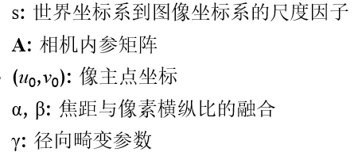
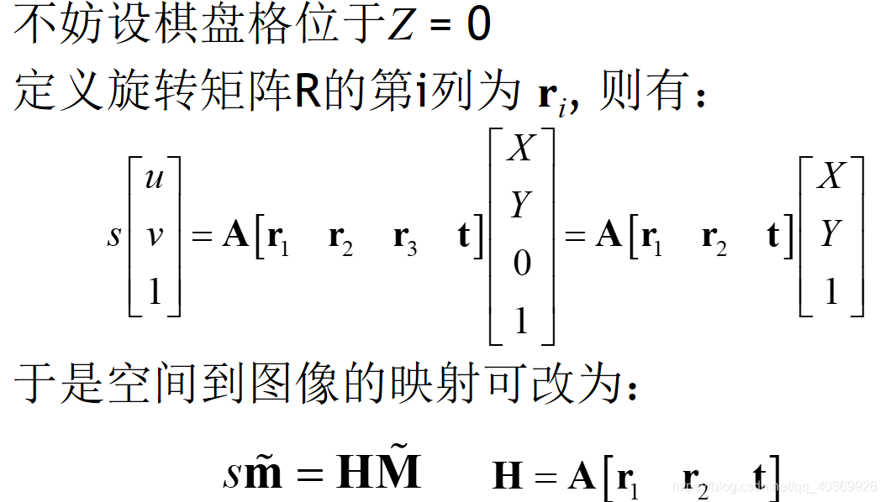
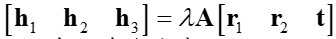
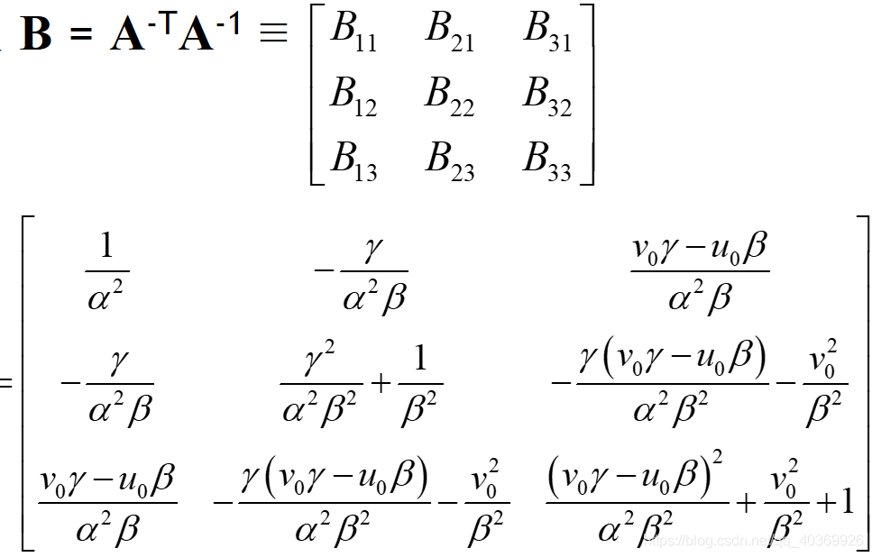
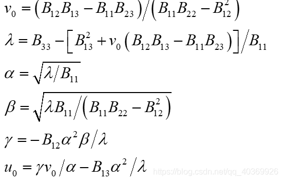
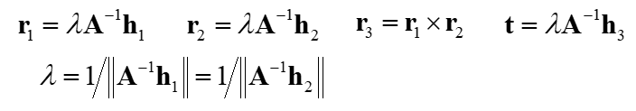
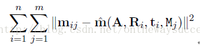

## 内参标定：相机标定

相机拍摄中：物点到像点的坐标转换方程

$$
x=K[R|t]X\\
K:内参矩阵\\
[R|t]:外参矩阵
$$

#### **1、DLT标定**

$$
s\left[\begin{matrix}u\\v\\1\end{matrix}\right]=
\left[\begin{matrix}l_1&l_2&l_3&l_4\\l_5&l_6&l_7&l_8\\l_9&l_{10}&l_{11}&l_{12}\end{matrix}\right]
\left[\begin{matrix}X\\Y\\Z\\1\end{matrix}\right]
$$

$$
L_{3\times4}=\left[\begin{matrix}l_1&l_2&l_3&l_4\\l_5&l_6&l_7&l_8\\l_9&l_{10}&l_{11}&l_{12}\end{matrix}\right]
$$

$$
u=(l_1X+l_2Y+l_3Z+l_4)/Z_C\\
v=(l_5X+l_6Y+l_7Z+l_8)/Z_C\\
Z_C=l_9X+l_{10}Y+l_{11}Z+l_{12}
$$

12个参数，L阵可以表达为如下形式
$$
L_{3\times4}=AF[R|t]\\
A=\left[\begin{matrix}\frac{1}{d_x}&0&\mu_0\\0&\frac{1}{d_y}&\nu_0\\0&0&0\end{matrix}\right]\\
A:相机内参矩阵\\
F=\left[\begin{matrix}f&0&0&0\\0&f&0&0\\0&0&1&0\end{matrix}\right]\\
F:像平面坐标系到像空间坐标系的转换\\
$$

$$
通常令l_{12}=1:有11个参数
$$

（1）几何解法

直接对上式泰勒展开求导求解，几何最优

传统实验方法：检测场标定(属于3维标定，物方坐标XYZ)

（2）数学解法

将上式变换为
$$
Z_Cu=l_1X+l_2Y+l_3Z+l_4\\
Z_Cv=l_5X+l_6Y+l_7Z+l_8
$$
线性求解，为数学最优解法 。可参考opencv库

DLT方法总结：

DLT解法需要至少6个点，提供12个方程，求解11个参数。

一般用于确定摄影测量中相机的姿态，研究PnP问题（Perspective on Points），不用知道相机的内参，直接求解出11个DLT参数即可，用于精度较低的摄影测量工作中。

也可以用于求解相机内参矩阵A，这时通过先求解11个参数，再求解出A阵即可。

​	

#### **2、张正友标定，使用棋盘格标定**

论文：https://ieeexplore.ieee.org/document/888718

CSDN：https://blog.csdn.net/qq_40369926/article/details/89251296

**标定流程**：

（1）打印棋盘格，多角度拍照，获取相机数据

（2）理想无畸变情况下，求解相机的5个内参，和外参

（3）求出径向畸变参数，L-M求解

（4）内外参数，和畸变，共同极大似然估计求解

（5）得到相机内外参数，畸变系数

**模型假设：**

物方点到像点坐标转换公式：
$$
\lambda x=K[R|t]X\\
x:图像坐标系\\
X:世界坐标系
$$
本文中写为：
$$
sm=A[R|t]M\\
2D图像点：m=[u,v]^T\\
3D空间点：M=[X,Y,Z]^T\\
齐次坐标：\vec{m}=[u,v,1]^T,\vec{M}=[X,Y,Z,1]^T\\
描述空间坐标系到图像坐标的映射
$$

$$
s\vec{m}=A[R|t]\vec{M}\\
A=\left[\begin{matrix}
\alpha&\gamma&\mu_0\\
0&\beta&\nu_0\\
0&0&1
\end{matrix}\right]
$$

$$
S：世界坐标系到图像坐标系的尺度因子\\
A:相机的内参矩阵\\
(u_0,v_0):像主点坐标\\
\alpha,\beta:即f_x.f_y,相机的在x,y方向上的焦距\\
\gamma:径向畸变参数，一般为0\\
$$

**模型求解：**

（1）内外参数求解

H阵，为单应性矩阵3*3。9-1=8个参数

利用，中r1，r2正交，模均为1的性质，求解h1，h2.

剩余A阵中5个参数，通过3个单应性矩阵可以求解

可以看到，B是一个对称阵，所以B的有效元素为六个，让这六个元素写成向量b，即:
$$
b=\left[ \begin{array}{cccccc} B_{11} & B_{12} & B_{22} & B_{13} & B_{23} & B_{33} \end{array} \right]^T
$$
推导得到
$$
h_i^TBh_j = v^T_{ij}b \\
v_{ij}=\left[ \begin{array}{cccccc} h_{i1}h_{j1} & h_{i1}h_{j2}+h_{i2}h_{j1} & h_{i2}h_{j2} & h_{i3}h_{j1}+h_{i1}h_{j3} & h_{i3}h_{j2}+h_{i2}h_{j3} & h_{i3}h_{j3} \end{array} \right]^T
$$
利用约束条件可以得到：
$$
\left[ \begin{array}{c} v^T_{12} \\ (v_{11}-v_{22})^T \end{array} \right]b=0
$$
通过上式，我们至少需要三幅包含棋盘格的图像，可以计算得到B，然后通过cholesky分解，得到相机的内参数矩阵A

求解内参得：

外参：

（2）精度优化

算法的优化：

使用MLE极大似然估计，考虑到了实际观测中的误差。

n个棋盘，每个棋盘有m个点，每个点的误差独立同分布。

再使用LM求解

（3）畸变系数求解

由于成像畸变主要由径向畸变导致，张氏标定法使用极大似然的思想对k1, k2进行了优化。优化方式同样采用可以采用Levenverg-Marquardt算法。

$$
\sum^n_{i=1}\sum^m_{j=1} \| \hat{m}(K,k_1,k_2,R_i,t_i,M_{ij})-m_{ij} \|^2
$$
可以求出相机的畸变参数。

用来对图像的进行畸变的矫正。

#### **3、AprilTag标定**

用一系列二维码进行标定

1. 根据梯度检测出图像中的各种边缘。
2. 在边缘图像中找出需要的四边形图案并进行筛选，AprilTag尽可能的对检测出的边缘检测，首先剔除非直线边缘，在直线边缘进行邻接边缘查找，最终若形成闭环则为检测到一个四边形。
3. 进行二维码编码和二维码解码，编码方式分为三种，其黑边色块长度分别为8，7，6三个色块长度，对于解码内容，要在检测到的四边形内生成点阵列用于计算每色块的值，再根据局部二值模式(Local Binary Patterns)构造简单分类器对四边形内的色块进行分类，将正例色块编码为1将负例色块编码为0，就可以得到该二维码的编码。得到编码以后再与已知库内的编码进行匹配，确定解码出的二维码是否为正确

https://blog.csdn.net/han784851198/article/details/90261197

#### **4、其它标定方式**

halcon标定

**5、常用标定工具或程序**
1、opencv

程序可见

2、ros calibration

标定过程可视化

3、matlab

matlab工具箱，最方便

**6、补充概念**

**单应性矩阵Homography matrix**

两个不同视角的图像上的点对的齐次坐标（homogeneous coordinate）可以用一个射影变换（projective transformation）表述，即：
$$
x_1=Hx_2
$$
在二维平面中，点的齐次坐标表示为（x,y,1）

x_1,x_2都是3*1的齐次坐标
单应性矩阵H为3X3的矩阵,有9个元素，结合齐次坐标的性质，单应矩阵H，同时乘以一个数，表达的转换关系相同，所以aXH和H等价，所以H只有8个未知数，一般令h33=1。

求解有8个未知数的单应性矩阵，我们需要4个点对求解，可以列出8个方程。大于4个点对，使用最小二乘方法求解最优值。

https://blog.csdn.net/zinnc/article/details/52319491

